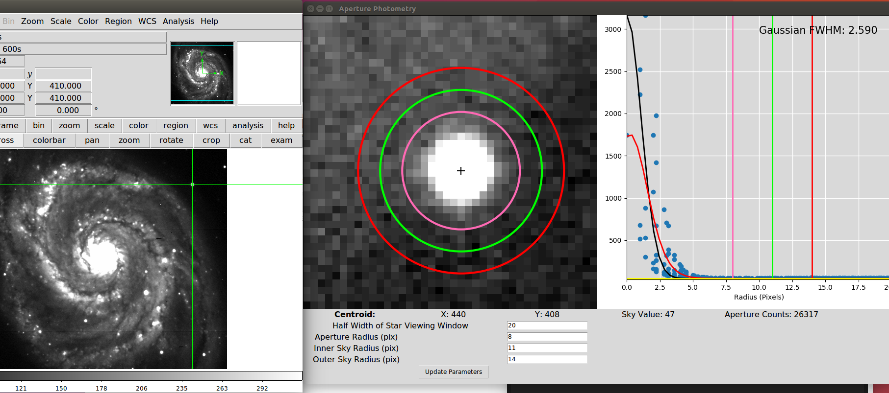

# Aperture-Photometry-in-DS9
A plugin python script for aperture photometry on files in DS9 with a single keypress.

## Installation
A completely default installation will clone the repository to \opt\local\bin. Customization is available and detailed below. 

The file "phot.ds9" must be placed in a directory searched by DS9 in order for single-keypress activation of the analysis script. In the default configuration, this directory is /opt/local/bin, but others are possible: see http://ds9.si.edu/doc/ref/analysis.html

Within the phot.ds9 file, you can change the installation location of the analysis script ds9_phot.py by altering the last line of the file. By default, the location is set to /opt/local/bin/ds9\_phot.py

If you choose a different installation directory, you must also alter the first line of ds9_phot.py to reflect this. The supporting file phot\_vars.py must be in the same directory as ds9\_phot.py

## Dependencies
The analysis script requires numpy, scipy, matplotlib, photutils, and pyds9. The analysis script ds9\_phot.py uses Tkinter for graphical display. 

The package was built on Ubuntu 14.04 / 16.04 with package versions:
  * numpy==1.12.1
  * scipy==0.19.0
  * matplotlib==2.0.0
  * photutils==0.3.2
  * pyds9==1.8.1

After development is mostly complete, I will check compatibility with older versions on another computer.

## Features
The analysis script ds9\_phot.py stars by grabbing data from the crosshair (Edit >> Cross in DS9 toolbar) of DS9 using pyds9, determines the centroid of the source selected, plots the data using zscale from https://github.com/spacetelescope/stsci.numdisplay/blob/master/lib/stsci/numdisplay/zscale.py and plots the apertures used for the photmetry. In an adjacent plot, it shows the radial distribution of pixel counts, with the aperture radii also shown. Also shown are 1D Gaussian and Moffat functions, with the FWHM of the Gaussian fit displayed in the upper right of the window. Sky background and aperture counts are determined using photutils.

Below is a screenshot of the output of the analysis script.

## Usage
If installed correctly, you can open DS9 from any directory with any .fits file and the script will work properly. Select the crosshair tool from Edit >> Cross in the toolbar and drag the crosshair close to the centroid of the source you want to perform aperture photometry on. Let the crosshair there and press "p". A new window should appear with a zoomed-in image of the source and the radial distribution of pixel counts, with fit Moffat and Gaussian functions, sky background level, and aperture counts. You can change values for the apertures in the boxes in the new window, and these will be remembered from one session to another. 

To examine another source, move the crosshair in the DS9 window, then click back into the Tkinter window and press p again. If you press p while in the DS9 window with the analysis screen still up, DS9 will tell you the analysis task is already running. You should click back into the analysis window before pressing p to analyze a new source. 

## Upcoming Features
Planning to add a menu to select between different functions to fit to the radial profile. Currently it shows Gaussian and Moffat functions, but I'm not certain the Moffat function is working right yet. The Gaussian FWHM value should be good, and the fit seems to work. Aperture photometry results seem similar to IDL's ATV, with slight differences arising from how we do background subtraction, I think. 
I don't plan to add any type of output to text file or anything like that -- I envision this tool being used to check FWHM's and aperture counts while observing or as cursory inspection to new data. 
